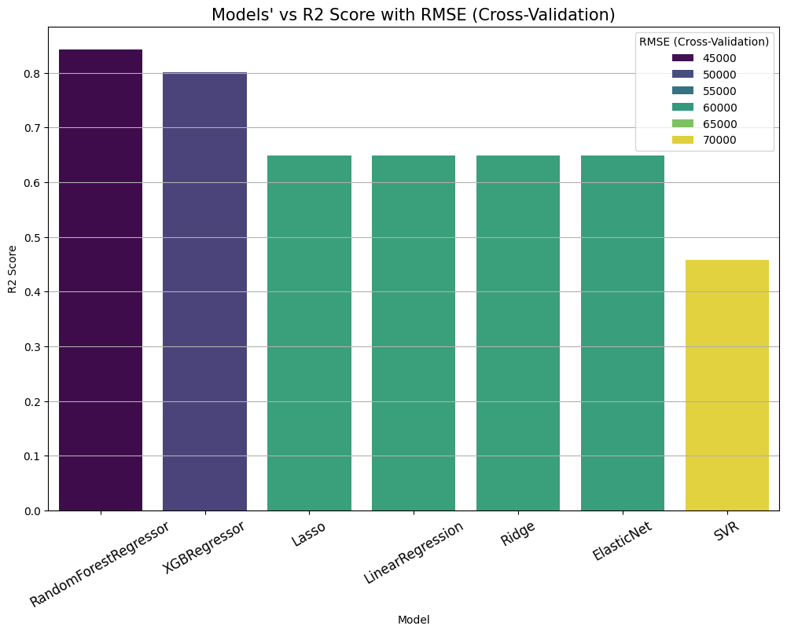
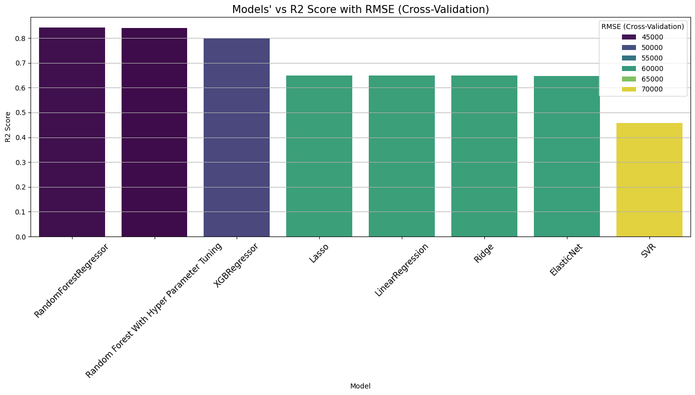

<body>
<h1> House Sale Price Prediction <a href="http://15.206.170.241:8501/" target="_blank">http://15.206.170.241:8501/</a> </h1>

<h2>Accuracy (R2 Score) of Model: 0.84</h2>

<h2>Data Preprocessing</h2>

  This project focuses on predicting house sale prices. Below are the steps taken for data preprocessing:

<h3>Step 1: Installation of Required Libraries</h3>

  The initial step involves installing necessary libraries from the <code>requirements.txt</code> file.

<h3>Step 2: Data Cleaning</h3>

  The dataset stored in the "DATA" folder as <code>sample_dataset.csv</code> underwent thorough cleaning. Steps included outlier removal, handling duplicate entries, and eliminating unwanted columns.

<h3>Step 3: Preprocessed Data</h3>

  Post-cleaning, the preprocessed data was saved as <code>preprocessed_data.csv</code> in the "DATA" folder.

<h3>Step 4: Data Splitting</h3>

  The dataset was split into training and testing sets (<code>X_train</code>, <code>y_train</code>, <code>X_test</code>, <code>y_test</code>), which were stored in NumPy data format in the "DATA" folder.

 

<h3>### **Feature Engineering**</h3>
- ***A new feature, <code>'price_for_Squarefit'</code>, has been engineered, adding valuable information to the dataset. This new feature is highly relevant as it provides insights into the pricing based on square footage. Including this feature contributes significantly to addressing underfitting, enhancing the model's ability to capture the complexity of pricing dynamics.***

<body>
<h2>Regression Model Training</h2>

  For regression model training, the following steps were undertaken:

<h3>Step 1: Regression Models and Metrics</h3>

  In the <code>Task 2_Regression.ipynb</code> file within the "Code" folder, regression models were implemented, and metrics such as MAE, MSE, RMSE, R2 Score, and RMSE (Cross-Validation) were evaluated.

<h3>Step 2: Model Evaluation</h3>

  Various regression models like Linear Regression, Ridge Regression, Lasso Regression, Elastic Net, Support Vector Machines, Random Forest Regressor, XGBoost Regressor were compared based on their performance metrics.

  
  

  From the graphs and numerical evaluations, the <code>RandomForest Regressor</code> shows superior performance, displaying a <code>high R2 score and low RMSE</code>, indicating its predictive capability.
  Subsequently, Hyperparameter Tuning was implemented for the RandomForest Regressor.
  

  
  

   However, the selected hyperparameters did not suit the dataset, resulting in a decrease in performance metrics such as <code>R2 score and RMSE</code>.

<h3>Reasons for Decrease in Performance:</h3>
<ul>
  <li>Hyperparameter tuning aims to enhance model performance but may not align with the dataset, leading to reduced R2 score and RMSE.</li>
  <li>Adjustments to prevent overfitting might limit the model's ability to capture complex patterns.</li>
  <li>Suboptimal hyperparameters can hinder generalization to new data.</li>
</ul>

Thus, the <code>Random Forest Regressor</code> is selected for Model Hosting.

<h3>Step 3: Model Deployment using Streamlit</h3>

  Random Forest Regressor was used to create a <code>model.pkl</code> file. Additionally, an <code>app.py</code> file was created for deployment using Streamlit.

To run the model, use the command: <code>streamlit run app.py</code>

A Docker file was created and hosted on AWS.

<h3>Hosted Model</h3>

  The model is hosted at: <a href="http://15.206.170.241:8501/" target="_blank">http://15.206.170.241:8501/</a>

<h2>File Structure</h2>
<pre>
- Code
  - Task 1_Preprocessing.ipynb
  - Task 2_Regression.ipynb
  - app.py
  - requirements.txt
- DATA
  - sample_dataset.csv
  - preprocessed_data.csv
  - X.npy
  - y.npy
  - X_test.npy
  - X_train.npy
  - y_test.npy
  - y_train.npy
- IMG
  - 1.png
  - 2.png
  -logo.png

</pre>

  This README provides an overview of the steps involved in the House Sale Price Prediction project, including data preprocessing, regression model training, evaluation, and deployment using Streamlit.

</body>

